# System Design

## Introduction

We are building a Peer Review Application, aimed at simplifying the assignment submission and review processes for students and instructors. The primary purpose of this application is to streamline the peer review process in educational settings.

This platform will allow instructors to set assignments to be peer-reviewed by  other students, providing easy access for students to both submit their work and receive feedback from their peers. This not only enhances the learning experience but also fosters a collaborative environment amongst students.

## System Architecture Design

The System Architecture Model we have chosen is MVC, due to its simple design, flexibility and maintainability. The simple and organized structure of this architecture allows our application to be well organized and easily testable through development. As the MVC pattern separates the system components into three layers, each component can be subdivided and isolated. This makes it easy to add/change features which can be tested independently of others. With each layer handling different functions of the system, development on one will not conflict with another, thus allowing us to build the system in parallel. The simple structure of a web application makes this pattern the best fit, due to the clear separation of each layer.

As an MVC pattern, our system is divided into the 3 main layers: 
* **Model**          
* **View**
* **Controller**

Each layer contains one or several components, where those components are isolated in their own container. Outside the layers, the ***"Users"*** indicates any user that accesses the application, which is sent to a reverse proxy to determine user type and proper navigation. This protocol is not directly connected to the application but containerized as a transfer protocol telling the controller which view component to access. The View layer is the front-end system the users will interact with which makes the requests to the controller. This layer contains two main view components: **the instructor dashboard and the student dashboard**, which may interact with each other, but act independently. The Controller is simply our main system logic, handling all requests by the user, sending and receiving data from the model (Database), and interacting with added APIs. The chosen framework for the controller is Next.js, allowing for simple API integration and future scalability. Finally, the Model of our system is our database, which solely interacts with the controller, processing any requests and transmitting data back. The initial database framework chosen is MySQL as the database will be relational and its accessibility with Node, however this framework may change. 

## Use Case Models
Here is the comprehensive list of derived use case models, carefully tailored to meet the user requirements and envisioned usage.

| Use Case ID | Use Case                                       | Actors                |
|-------------|------------------------------------------------|-----------------------|
| 1.1         | Create Account                                 | Student, Instructor   |
| 1.2         | Create Classroom                               | Instructor, Admin     |
| 2           | Course Registration                            | Student               |
| 3.1         | Log in                                         | Student, Instructor, Admin |
| 3.2         | Forget Password                                | Student, Instructor, Admin |
| 4.1         | Creation of Assignments Submissions            | Instructor            |
| 4.2         | Creation and Release of Peer Reviewed Assignments | Instructor          |
| 5.1         | Submit (to be peer-reviewed) Assignments       | Student               |
| 5.2         | Submit Peer reviewed Assignments               | Student               |
| 6.1         | View Classrooms Dashboard(Instructor)          | Instructor            |
| 6.2         | View Classrooms Dashboard(Student)             | Student               |
| 6.3         | View Classrooms Dashboard(Admin)               | Admin                 |
| 7           | View Grades Dashboard(Individual)              | Instructor, Student   |
| 8           | Create Instructor user                         | Admin                 |
| 9           | User and Analytics Dashboard                   | Admin                 |

|**ID:**|1\.1|
| :- | :- |
|**Name:**|Create Account|
|**Actors:**|Student, Instructor|
|**Flow of Events**|
1. Navigate to Create account

2. Choose whether a Student or Instructor user

3. If the user is a student, the page redirects to student registration. If the user is an instructor, it redirects to the instructor registration.

4. Enter valid account information

5. Redirects to the login page.
|
|**Pre-Conditions**|
1. All users, except the admin, must be logged out

2. Account must not exist
|
|**Post-Conditions**|
1. User Account is created and stored in DB

2. The Instructor user is redirected to the Login, and Student users are to the student registration
|
|**Description**|
- The initial page allows students to register and fill out required information such as user ID, email, institution, etc. 

- Students after they fill in their information are directed to login 

- Instructors will create an account here 
|

|**ID:**|1\.2|
| :- | :- |
|**Name:**|Create Classroom|
|**Actors:**|Instructor, Admin|
|**Flow of Events**|
1. The instructor or Admin creates an instance of a classroom

2. They fill out the required classroom name, details, and number

3. Upload a.csv with student user ID, student name and student email.

4. Save the Classroom created
|
|**Pre-Conditions**|
1. Instructor or Admin must be logged in 

2. The classroom must not exist while being created
|
|**Post-Conditions**|
1. The classroom is stored in the system DB

2. The classroom is ready for students when registering and logging in 
|
|**Description**|
- This feature is exclusively for instructors and admin users only

- This is where the .csv with at least a unique ID and name must be present 

- Admin can manually create the classroom on the Admin dashboard
|

|**ID:**|2|
| :- | :- |
|**Name:**|Course Registration|
|**Actors:**|Student|
|**Flow of Events**|
1. Redirected to this page, students find the classroom name

2. They identify their name and ID in the classroom details

3. They choose their respective ID, name and classroom and join the classroom

4. After successfully joining the classroom, they are redirected to the course dashboard
|
|**Pre-Conditions**|
1. Account must be created 

2. The classroom must be created

3. The student's name and ID must be added to the classroom before joining 
|
|**Post-Conditions**|
1. Students must be added to the classroom and registered in the DB 

2. Students must be able to log in and view their classroom 
|
|**Description**|
- Students should find their name and ID on a list after registering and choosing the institute they are in 

- This page will have a list of classrooms, after choosing a classroom the students must find their names and join 
|

|**ID:**|3\.1|
| :- | :- |
|**Name:**|Log in|
|**Actors:**|Student, Instructor, Admin|
|**Flow of Events**|
1. Redirected to this page, Instructor and Students can log in through this log-in page 

2. If the user does not exist, redirect to the Create Account page

3. Admin must forget the password to be redirected to the Forget password page

4. Enter user credentials for authentication

5. If the user has forgotten the password, click “Forget Password” to be redirected to the Forget Password page 
|
|**Pre-Conditions**|
1. All users must be logged out 

2. User credentials should match DB entries

3. Account must be created initially
|
|**Post-Conditions**|
1. After successful authentication, the student and instructor are redirected to the Classroom dashboard

2. ` `If “Forget password?” clicked, redirect to Forget password page
|
|**Description**|
- Standard Login process for instructors and students to access the classroom dashboard

- Admin must log in through the forget password path
|

|**ID:**|3\.2|
| :- | :- |
|**Name:**|Forget Password|
|**Actors:**|Student, Instructor, Admin|
|**Flow of Events**|
1. Redirected here to fill form for password reset 

2. Initially, a prompt is to be filled with an email ID. 

3. If the input email matches the same email from DB, an email is sent for password recovery steps

4. A password reset form is set and stores the updated password to the Database.

5. Admin Login:

&emsp;a. Admin must come here and find the Admin login portal page

&emsp;b. After successful authentication, is redirected to Admin Dashboard
|
|**Pre-Conditions**|
1. Account must exist

2. Password is forgotten or needs reset 

3. Admin must know the password for login 

4. User name and email must match as registered in the DB  
|
|**Post-Conditions**|
1. The user receives an email to reset

2. The user password is reset, after following the recovery steps

3. Admin logs in successfully and gets redirected to the admin dashboard
|
|**Description**|- The forget password page will only prompt email and username details, it also has the portal button for the admin|

|**ID:**|4\.1|
| :- | :- |
|**Name:**|Creation of Assignments Submissions|
|**Actors:**|Instructor|
|**Flow of Events**|
1. Instructor log into their account 

2. They navigate to the Classroom 

3. They choose to create the assignment by clicking “Create Assignment” 

4. Provide a rubric or details for assignment submission 

5. Sends out assignment creation prompts to student users in the classroom 
|
|**Pre-Conditions**|
1. The instructor must be logged in 

2. The instructor must provide a title and some description for the assignment  
|
|**Post-Conditions**|
1. The assignment is created and stored in DB 

2. The assignment is visible and able for student users to submit
|
|**Description**|
- This is only for assignments to be peer-reviewed by other student users

- The instructor can set restrictions here for file submissions
|

|**ID:**|4\.2|
| :- | :- |
|**Name:**|Creation and Release of Peer Reviewed Assignments|
|**Actors:**|Instructor|
|**Flow of Events**|
1. Instructor log into their account 

2. They navigate to the Classroom 

3. They choose to release assignments for randomized peer review by clicking the “Release Assignments” filling in the details and asking for the anonymity status

4. Just before releasing the prompt, a confirmation alert is prompted

5. Confirmation notification asks the instructor to choose the anonymity status of the review if not filled

6. After filling in the details, the assignment is sent out to student users

7. After all assignments are already reviewed and submitted, on this page, they can release the grades after reviewing, by clicking Release grades
|
|**Pre-Conditions**|
1. The instructor must be logged in 

2. For releasing the grade, the peer review must be completed as per requirements by the instructor

3. ` `Assignments for peer review must be submitted initially(Case 4.1 must exist)
|
|**Post-Conditions**|
1. Post-release of peer review prompt, the assignment is sent for students to finish 

2. After the peer review evaluation is complete, the instructor releases the grade

3. The instructor is redirected to the Classroom dashboard
|
|**Description**|
- This flow of instructions shall be followed for any peer review and submission of peer review

- The instructor must specify whether the assignment is to be anonymously graded or not. 
|

|**ID:**|5\.1|
| :- | :- |
|**Name:**|Submit (to be peer-reviewed) Assignments|
|**Actors:**|Student|
|**Flow of Events**|
1. Student logs into their account

2. They navigate to the Classroom Dashboard

3. They choose the respective classroom to submit the assignment 

4. They find the “Assignment Submission” prompt and submit assignments as per instructions

5. Click submit Assignment 

6. Get redirected to the Classroom dashboard
|
|**Pre-Conditions**|
1. Students must log in 

2. The assignment to be submitted must be created 
|
|**Post-Conditions**|
1. The submitted assignment must be stored in the system DB 

2. The submitted assignment must follow the instructions, or else must be alerted

3. The student gets redirected to the Classroom Dashboard
|
|**Description**|
- This is the flow of instructions for students to submit assignments to be peer-reviewed

- The file restrictions defined by the instructor will be in place, ensuring students only submit the required file or link by the instructor. 

- The link submitted should also follow the domain defined by the instructor
|

|**ID:**|5\.2|
| :- | :- |
|**Name:**|Submit Peer reviewed Assignments|
|**Actors:**|Student|
|**Flow of Events**|
1. Student logs into their account

2. They navigate to the Classroom Dashboard (Home)

3. They choose the classroom to provide feedback and review assignments

4. They find the “For Peer Evaluation” prompt and open the assignment to be reviewed

5. A quiz/form is prompted to be filled out for peer review

6. After review, the quiz/form is submitted

7. Get redirected to the Classroom Dashboard
|
|**Pre-Conditions**|
1. Students must log in 

2. The assignment prompt for peer review must be created 
|
|**Post-Conditions**|
1. The feedback/review submitted (the form/quiz) gets stored in system DB

2. The evaluated grade/feedback is sent back to the instructor for review and release of grade

3. The student gets redirected to the Classroom Dashboard
|
|**Description**|- Students should be required to fill out the form and not send in empty feedback prompts|

|**ID:**|6\.1|
| :- | :- |
|**Name:**|View Classrooms Dashboard(Instructor)|
|**Actors:**|Instructor|
|**Flow of Events**|
1. The instructor logs into their account

2. They are redirected to the Institute page to choose the institution they want

3. Once the institute is chosen, all of the classrooms created (in the same institute) will be visible here for future actions
|
|**Pre-Conditions**|
1. The instructor must be logged in 

2. The instructor must have access to their institution 
|
|**Post-Conditions**|
1. Assignment Creation and Submission can be followed from this page

2. Login/Logout of account from this page 

3. Grades of individuals and classrooms can be accessed from here 
|
|**Description**|
- This is the instructor's Classroom Dashboard 

- If the instructor is part of multiple institutes, then the admin can grant permissions for the instructor to have access to multiple institutions Classroom Dashboard 
|

|**ID:**|6\.2|
| :- | :- |
|**Name:**|View Classrooms Dashboard(Student)|
|**Actors:**|` `Student|
|**Flow of Events**|
1. The student logs into their account

2. They are redirected to this page to view their respective Classrooms
|
|**Pre-Conditions**|
1. The student must be logged in 

2. The classroom can only be viewed if the student is part of it.
|
|**Post-Conditions**|
1. Assignments Submission and Peer Review evaluations can be followed from this page

2. Login/Logout of account from this page

3. Grades and Progress of students in the classroom can be viewed
|
|**Description**|
- Students shall only be able to view the classrooms if they are part of it 

- Any of the functions mentions Classroom Dashboard, this is the page they will be redirected to or asked to use for any other functions 
|

|**ID:**|6\.3|
| :- | :- |
|**Name:**|View Classrooms Dashboard(Admin)|
|**Actors:**|` `Admin|
|**Flow of Events**|
1. The admin logs into their account

2. They are redirected to Admin Dashboard

3. They click “Classroom Dashboard” from the admin dashboard

4. The page will show the institute name

5. After an institute is selected, the admin should be able to view the list of classrooms in that respective institute.  
|
|**Pre-Conditions**|
1. Admin must be logged in 

2. Admin must press the “Classroom Dashboard”
|
|**Post-Conditions**|`     `Admin can create classrooms through their Admin Dashboard and view them here |
|**Description**|- Admin has a view of all the classrooms and institutes which are in the system|

|**ID:**|7|
| :- | :- |
|**Name:**|View Grades Dashboard(Individual)|
|**Actors:**|Instructor, Student|
|**Flow of Events**|
1. Instructor and Student must be logged in 

2. Student:

&emsp;a. After login, on their Classroom Dashboard they need to choose classroom

&emsp;b. After choosing a classroom, they can view grades by clicking the “View Grades” option from the Classroom Dashboard

&emsp;c. ` `Redirect them to the Grades Dashboard

3. Instructor:

&emsp;a. After login, the instructor follows the steps to get the Classroom Dashboard of the classroom they want to view grades of

&emsp;b. After finding the classroom dashboard, the Instructor clicks on “View Classroom and Individual Grades”

&emsp;c. Redirect them to the Grades Dashboard
|
|**Pre-Conditions**|
1. Instructors and Students must be logged in

2. The classroom needs to exist
|
|**Post-Conditions**|
1. Students should be able to view their average grade in the classroom

2. Instructors should be able to see individual students' progress

3. The instructor also gets an aggregate grade of the student's progress
|
|**Description**|
- The students must be able to view their grades and progress here 

- The instructor, releases grades should be visible to students here

- The instructor can view individual student grades or classroom progress 
|

|**ID:**|8|
| :- | :- |
|**Name:**|Create Instructor user|
|**Actors:**|Admin|
|**Flow of Events**|
1. Admin logs into admin account

2. View the Admin dashboard and click Create Instructor

3. Define privileges and institutes here

4. An institute for instructors must be created here 

5. Instructor can be created here
|
|**Pre-Conditions**|
1. Admin has all the privileges on the application

2. An institute instance needs to be created while creating an instructor account 
|
|**Post-Conditions**|1. Instructor account created and stored (with privileges) to teh system DB|
|**Description**|- Admin should be able to create the first instructor while creating the first institution|

|**ID:**|9|
| :- | :- |
|**Name:**|User and Analytics Dashboard|
|**Actors:**|Admin|
|**Flow of Events**|
1. Admin logs into admin account

2. They are redirected to the Admin Dashboard 
|
|**Pre-Conditions**|
1. Admin account is created while development 

2. Admin has options to create more admin accounts once deployed
|
|**Post-Conditions**|
1. Admin can view and create user accounts (Student and Instructor), remove user accounts and create classrooms and their respective dashboards

2. The admin needs to create institutions for classrooms and instructors initially after deployment

3. If an instructor creates an account their institution should be created here to maintain security
|
|**Description**|
- This is the main Admin Dashboard. 

- The admin has all privileges and creates users and instructors. 

- The admin can create classrooms and upload students' details through a .csv file.  
|

### Use Case Diagram
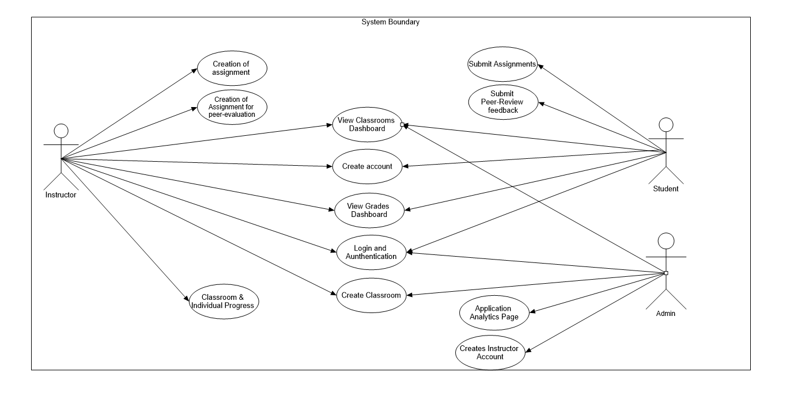
This is a high-level use case diagram. 

## Database Design 

This diagram shows how information will be represented as objects in a relational schema.

* Users will be broken down into 1 of the 2 mandatory subclasses, students and instructors. Instructors are connected to classes, assignments, and other users with some of their permissions depending on the isAdmin attribute. 
* Students are connected to the classes they're in, and they're connected to assignments through the weak entities that store information regarding their submissions and feedback.
* Classes are connected to the assignments within them, with the isArchived boolean being a foreign key so it's easy to archive all assignments within an archived class.

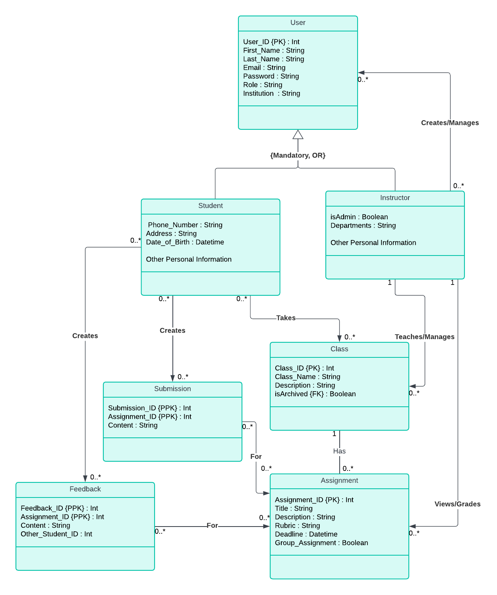

## Data Flow Diagram (Level 0/Level 1)
The diagrams you’re viewing are comprehensive representations of the data flow within the system. These data flow diagrams, or DFDs, serve as visual guides that depict the path of data through the various components of the system. The arrows in these diagrams, known as data flow arrows, define the direction and route of data transmission, providing a lucid understanding of the system’s data dynamics. 
### DFD Level 0
The Level 0 DFD, often referred to as the context diagram, offers a bird’s eye view of the system. It illustrates the interactions between users and the system, based on the inputs they provide. This high-level overview is instrumental in understanding the system’s basic operations and the flow of information from and to the users.

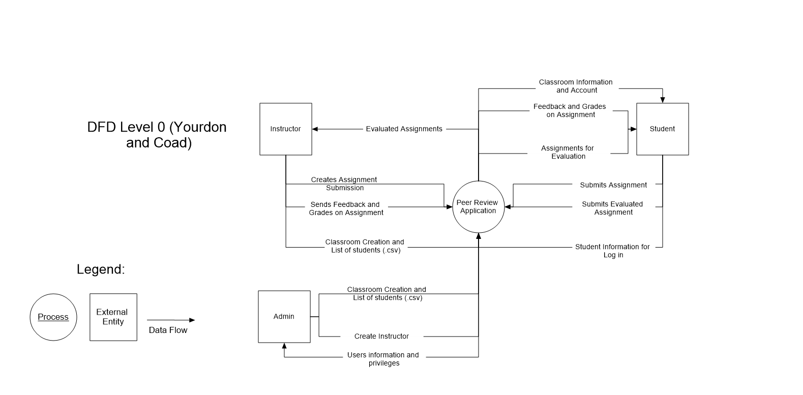

### DFD Level 1
On the other hand, the Level 1 DFD delves deeper into the system’s intricacies. It breaks down the system into numerous sub-processes, each with its own unique role. This detailed diagram provides insights into how these sub-systems interact with the users, and how data traverses through these interactions. By studying the Level 1 DFD, one can gain a more granular understanding of the system’s inner workings and the complex data flows within it.

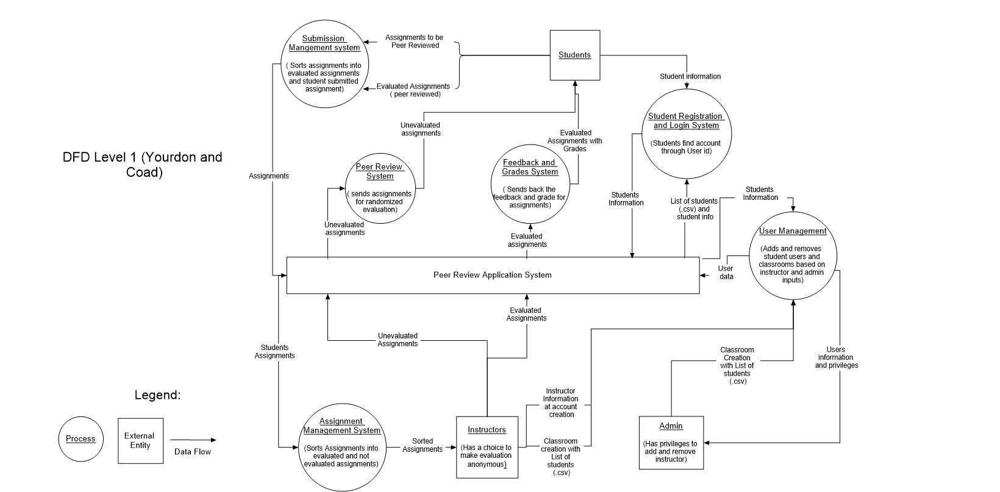

## User Interface (UI) Design

### Wireflow Diagram:

The wireflow diagram, shown below, describes how users will be interacting with the Peer Review Application.

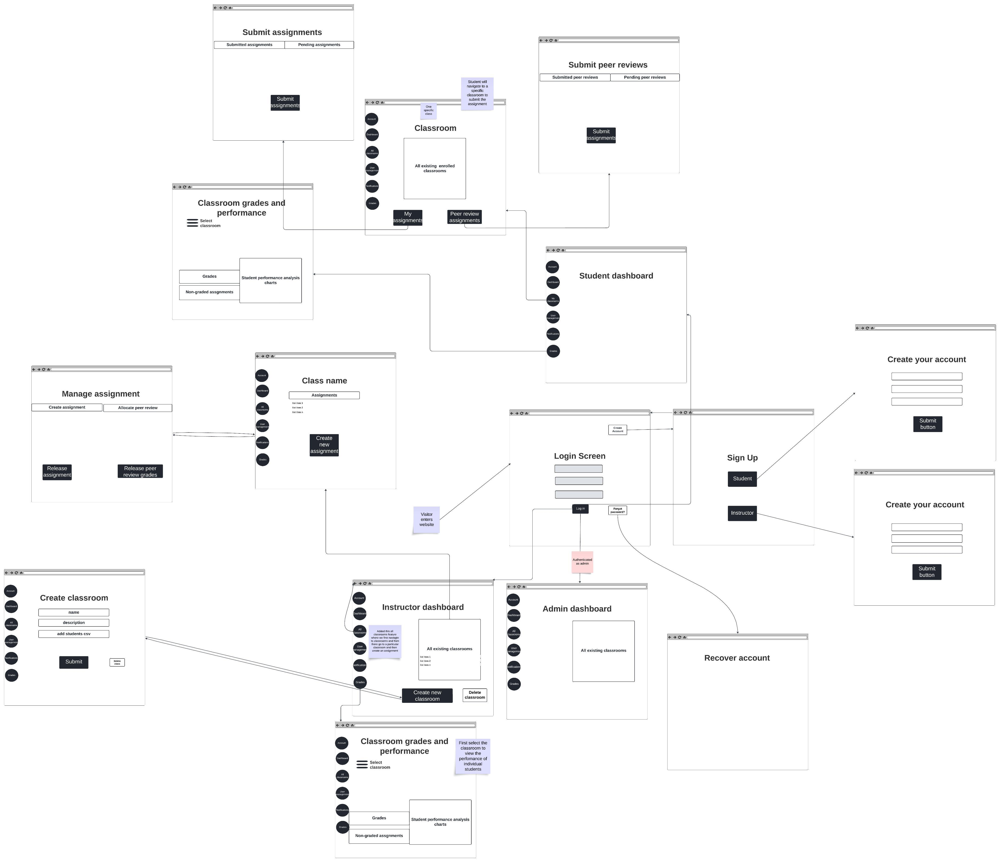
[Wireflow link here](https://lucid.app/lucidspark/27f7f586-1c38-438d-a66a-0492e525870c/edit?viewport_loc=-6787%2C-1561%2C7408%2C4182%2C0_0&invitationId=inv_a3cddd55-2816-4b02-b069-d5f64d055270)

### Key Design Mockups:

Using Figma, a more detailed interface of the application can be made to better visualize the use cases. With this in mind, here are a few key frames designed for the student and instructor users. The admin interface is the same as the instructor interface, with minimal additions, which is why it is not shown below.

#### Student Frames:

The following frames depict key student interactions with the system, including signup, login, homepage view, and their course dashboard.

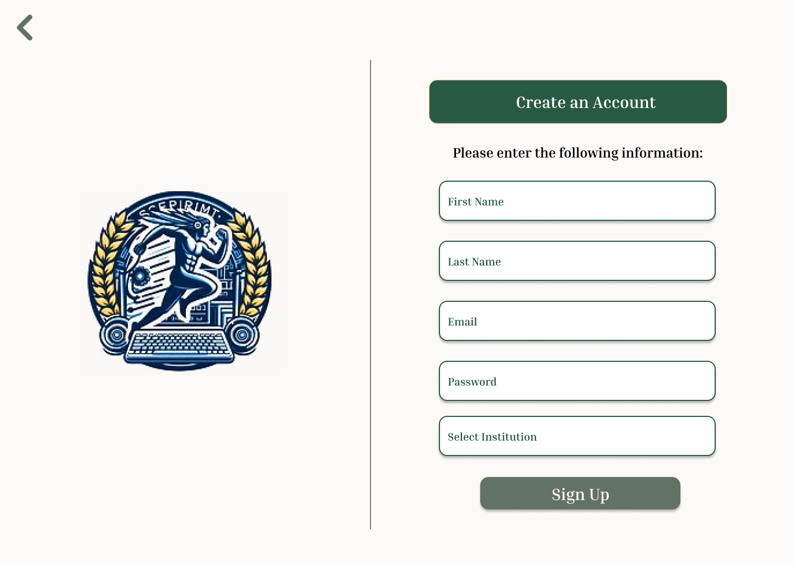

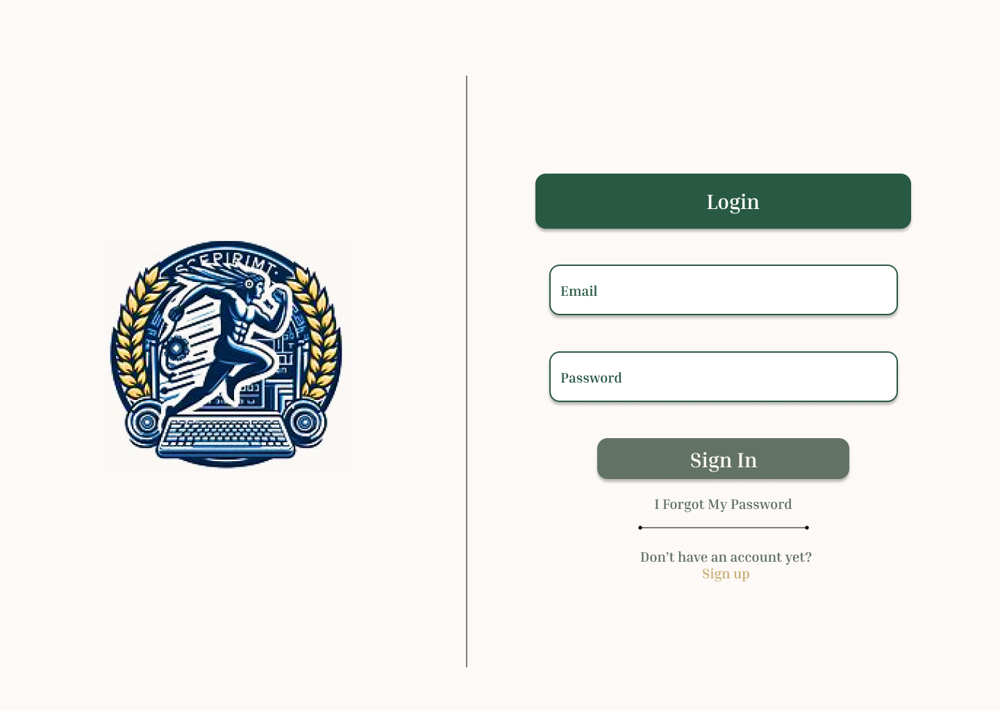

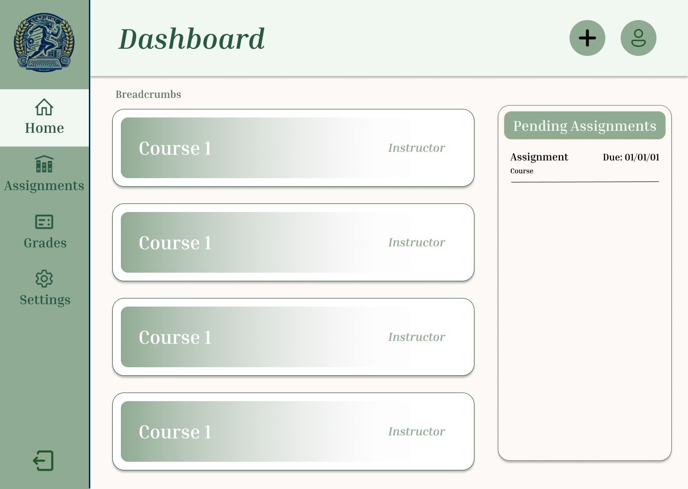

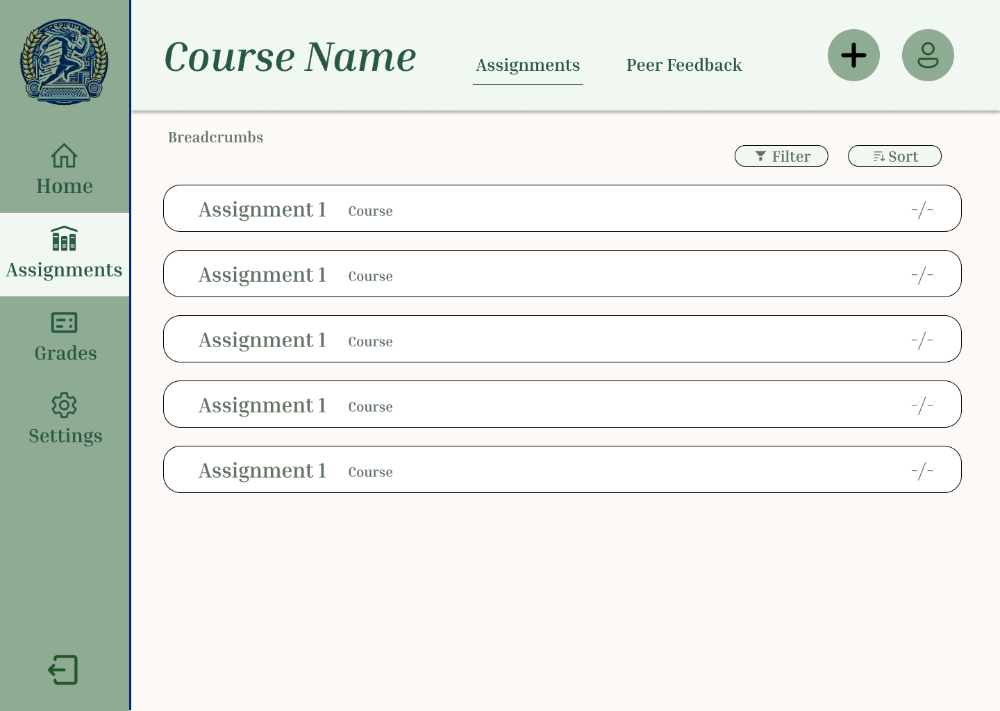

#### Instructor Frames:

The following frames depict key instructor interactions with the system, including signup, login, homepage view, create assignment, release assignment, and viewing student performance. 

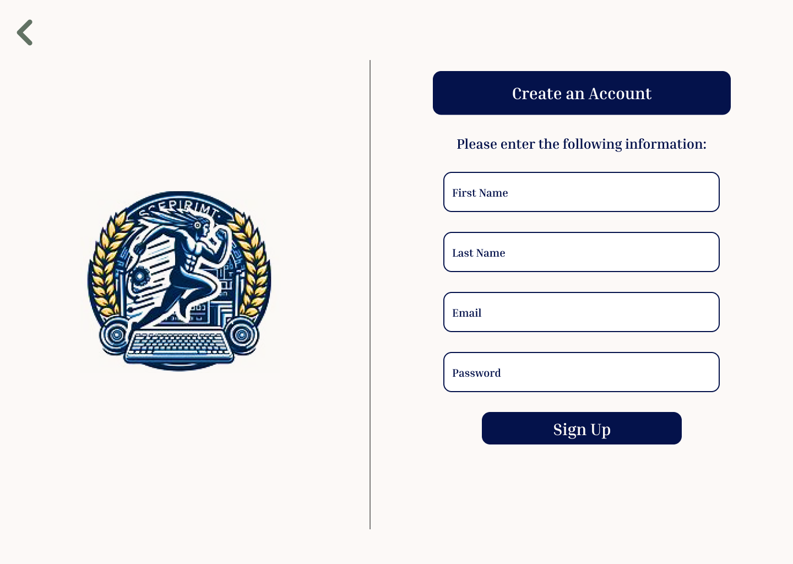

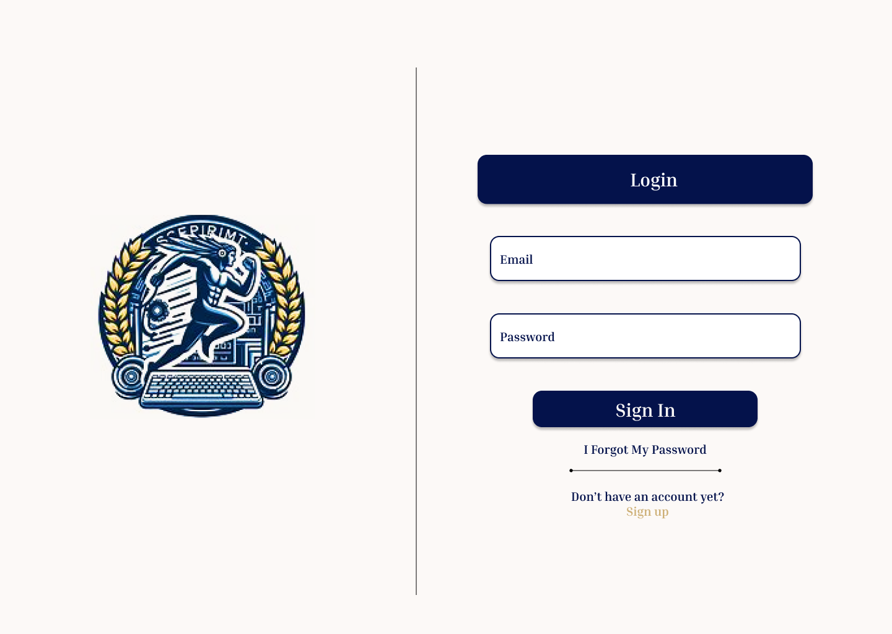

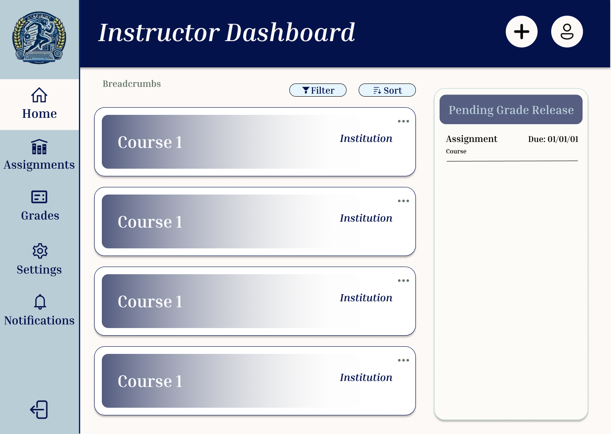

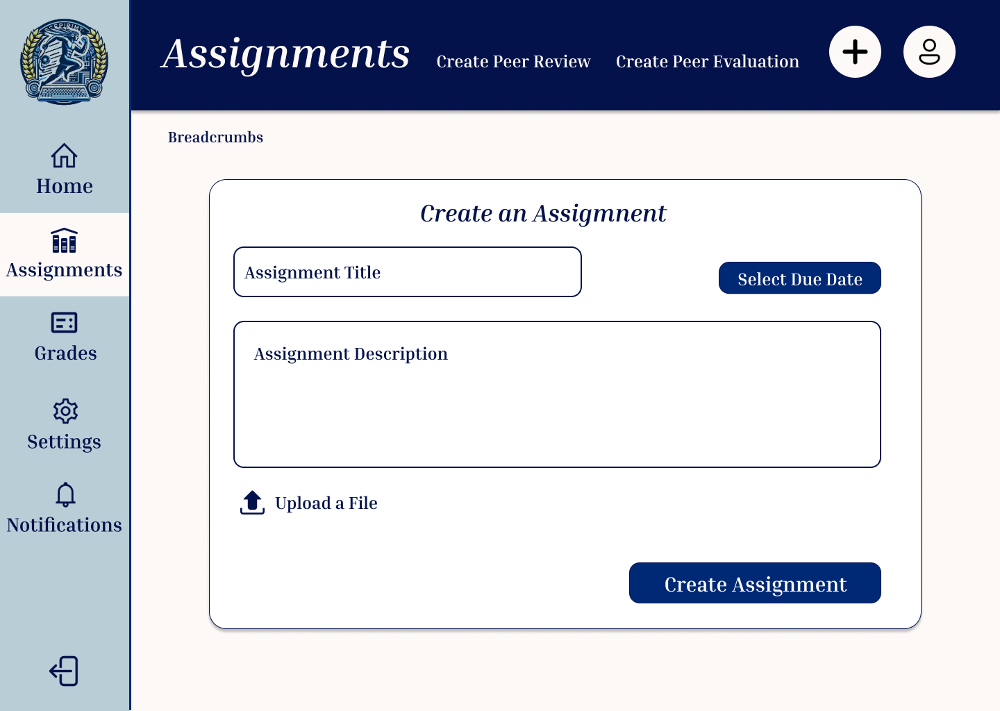

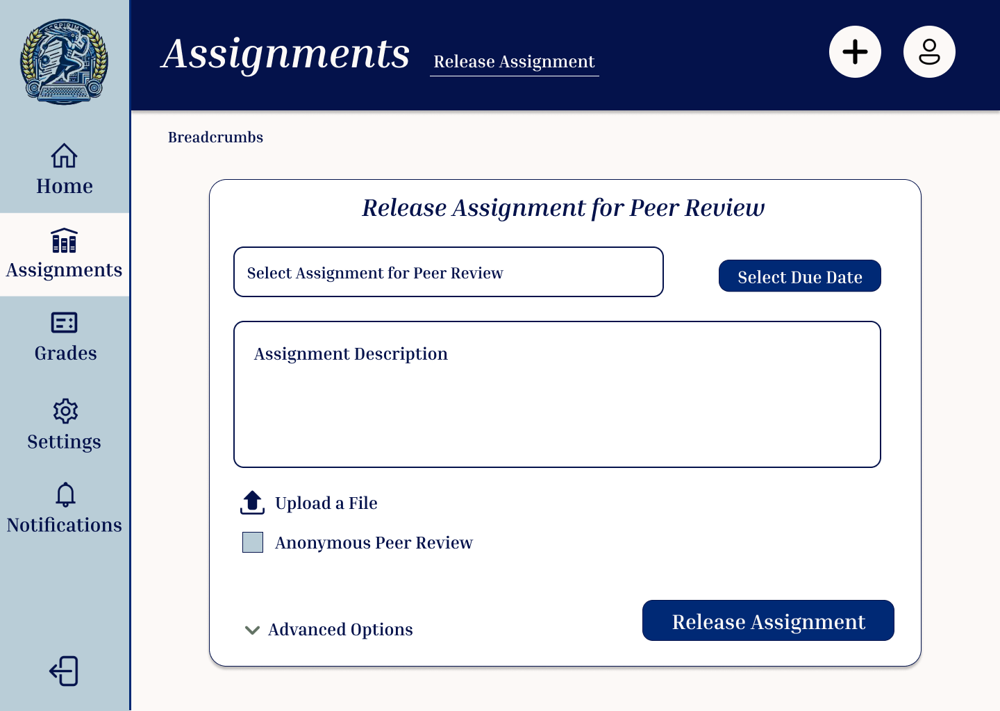

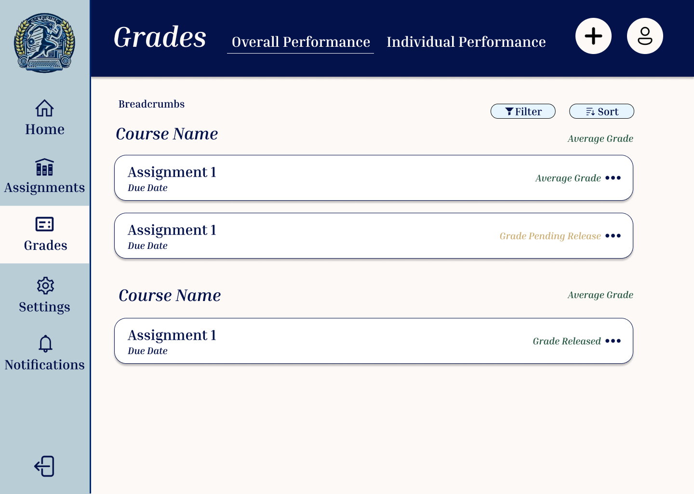

[Here](https://www.figma.com/design/6n2YkfmHc4Sa2xd1B8cBCP/Peer-Review--UI-Design?node-id=0-1&t=YiNBJKdJmiFIHNJP-1) is a link to the Figma prototype, which shows a more detailed version of user interaction with the application.
